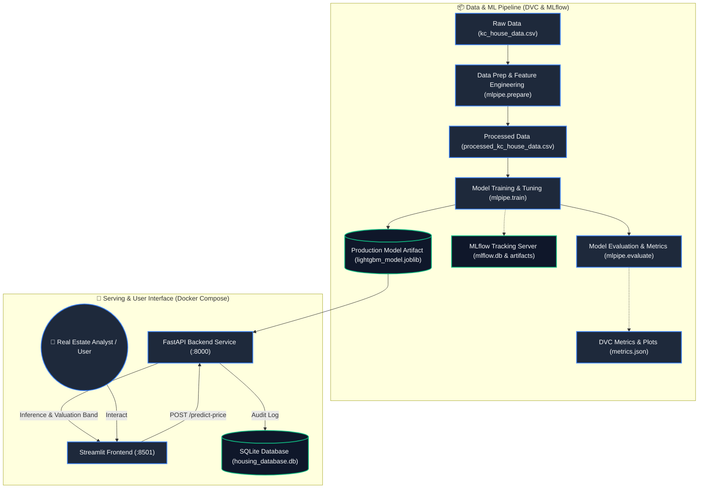

# 🏡 King County Real Estate Valuation & Price Prediction Engine

[](https://www.python.org/)
[](https://lightgbm.readthedocs.io/)
[](https://scikit-learn.org/)
[](https://dvc.org/)
[](https://mlflow.org/)
[](https://fastapi.tiangolo.com/)
[](https://streamlit.io/)
[](https://www.sqlalchemy.org/)
[](https://www.docker.com/)
[](https://pytest.org/)
[](LICENSE)

---

## 🎬 Demo Video

https://github.com/user-attachments/assets/YOUR_VIDEO_ASSET_ID_HERE

> 💡 **Tip:** Replace the link above with your uploaded GitHub demo video URL (drag-and-drop your `.mp4` into a GitHub Issue/PR or Releases to get the hosted URL).

---

## 📌 Project Overview

**King County House Valuation Engine** is an end-to-end, production-grade Machine Learning system designed to predict residential property prices in King County, Washington (including Seattle and surrounding regions). 

Unlike basic ML tutorials or isolated notebooks, this project establishes a complete **MLOps lifecycle**:
- **Reproducible Data & Training Pipelines** orchestrated via **DVC**.
- **Systematic Experiment Tracking & Model Registry** managed via **MLflow** across 17 distinct regression algorithms.
- **Production Inference Service** powered by **FastAPI** with Pydantic v2 data validation and real-time feature transformations.
- **Relational Prediction Audit Logging** with **SQLAlchemy** and **SQLite** to log all inference requests.
- **Interactive Valuation Dashboard** built in **Streamlit** with responsive inputs and ±10% confidence bands.
- **Containerized Microservices** deployed using **Docker** and **Docker Compose** with persistent database volumes.
- **Automated Test Suite** ensuring code quality using **pytest** and **HTTPX**.

---

## ✨ Key Features

- **🔬 Reproducible ML Pipelines (DVC)**: Modular data preparation, training, and evaluation stages defined in `dvc.yaml` for deterministic, version-controlled workflows.
- **📈 Comprehensive Experiment Tracking (MLflow)**: Compares 17 regression models (Linear, Ridge, Lasso, ElasticNet, SVR, KNN, Decision Trees, Random Forest, Extra Trees, Gradient Boosting, HistGradientBoosting, XGBoost, LightGBM, CatBoost) tracking $R^2$, MAE, RMSE, MAPE, and residual plots.
- **⚡ Production Champion Model (LightGBM)**: Selected model achieves **$R^2 \approx 0.9103$**, **MAPE $\approx 11.66\%$**, and **MAE $\approx \$62,971$** on log-transformed prices.
- **🧮 Domain-Specific Feature Engineering**: Automated feature extraction including log-scale adjustments, living-to-lot ratios, neighbor comparisons (`sqft_living_diff_from_neighbors`), house age, renovation latency, and one-hot zipcode encodings.
- **🌐 Robust FastAPI Backend**: Asynchronous REST API with lifespan model loading, strict schema validation, and healthcheck endpoints.
- **💾 Inference Audit Trail**: Every prediction request is automatically stored in a persistent SQLite database for auditing, drift analysis, and retrospective monitoring.
- **🖥️ Streamlit Valuation UI**: Multi-column responsive interface enabling quick adjustments of property dimensions, condition, construction grade, and geospatial coordinates.
- **🐳 Multi-Container Docker Architecture**: Dedicated backend and frontend Dockerfiles with internal Docker DNS networking, healthcheck probes, and persistent host volume mounts.
- **🧪 Comprehensive Pytest Suite**: Automated end-to-end unit and API integration tests utilizing in-memory SQLite fixtures.

---

## 🧠 System Architecture & Workflow



---

## 📊 Model Performance & Evaluation

The pipeline trains and evaluates regression models on King County housing data, applying a natural log transformation ($\ln(y)$) to mitigate target price skewness and heteroscedasticity.

### 🏆 Champion Model: LightGBM Regressor

| Metric | Score / Value | Description |
| :--- | :--- | :--- |
| **$R^2$ Score (Log Scale)** | **`0.9103`** | Explains over 91% of total variance in home valuation. |
| **Mean Absolute Error (MAE)** | **`$62,971.31`** | Average dollar deviation from true sale price. |
| **Root Mean Squared Error (RMSE)**| **`$111,846.28`** | Penalizes larger dollar valuation outliers. |
| **Mean Absolute Percentage Error (MAPE)** | **`11.66%`** | Relative percentage accuracy across all price tiers. |

Hyperparameters and model configurations are fully configurable in `para_config.yml`.

---

## 🛠️ Detailed Tech Stack

| Layer | Technology | Purpose & Responsibility |
| :--- | :--- | :--- |
| **Machine Learning** | [LightGBM](https://lightgbm.readthedocs.io/), [Scikit-Learn](https://scikit-learn.org/), [XGBoost](https://xgboost.readthedocs.io/), [CatBoost](https://catboost.ai/) | High-performance gradient-boosted decision trees and ensemble algorithms. |
| **Pipeline Versioning** | [DVC (Data Version Control)](https://dvc.org/) | Reproducible, staged ML pipelines (`prepare` ➔ `train` ➔ `evaluate`). |
| **Experiment Tracking** | [MLflow](https://mlflow.org/) | Tracking model runs, hyperparameters, metric curves, and residual plots. |
| **Backend REST API** | [FastAPI](https://fastapi.tiangolo.com/) | High-speed API server with automatic OpenAPI Swagger documentation. |
| **Data Validation** | [Pydantic v2](https://docs.pydantic.dev/) | Strict input type validation, boundary checks, and error responses. |
| **ASGI Web Server** | [Uvicorn](https://www.uvicorn.org/) | Production-ready ASGI server for serving FastAPI endpoints. |
| **Frontend Web App** | [Streamlit](https://streamlit.io/) | Interactive real estate valuation dashboard with instant recalculation. |
| **Database & ORM** | [SQLAlchemy](https://www.sqlalchemy.org/) + [SQLite](https://www.sqlite.org/) | Transactional storage of inference inputs, predictions, and timestamps. |
| **Containerization** | [Docker](https://www.docker.com/) & [Docker Compose](https://docs.docker.com/compose/) | Isolated multi-service orchestration with persistent volume mapping. |
| **Testing & Quality** | [Pytest](https://pytest.org/) + [HTTPX](https://www.encode.io/httpx/) | Integration tests with mocked in-memory database sessions. |

---

## 📂 Project Structure

```text
HousePricing/
├── backend/
│   ├── __init__.py
│   ├── main.py                  # FastAPI server with lifespan model loading & endpoints
│   └── schema.py                # Pydantic v2 schemas (HouseInput, PredictionResponse)
├── database/
│   ├── __init__.py
│   ├── housing_database.py      # SQLAlchemy ORM models, session management, & DB operations
│   └── housing_database.db      # SQLite persistent storage (persisted via Docker volume)
├── frontend/
│   └── app.py                   # Streamlit web interface with responsive input controls
├── mlpipe/
│   ├── config.py                # YAML parameter configuration loader
│   ├── features.py              # Domain feature engineering functions
│   ├── prepare.py               # Data cleaning and transformation pipeline step
│   ├── pipeline.py              # Scikit-learn Pipeline construction & preprocessing
│   ├── train.py                 # Multi-model training and MLflow logging logic
│   └── evaluate.py              # Model testing, evaluation metrics, and residual plot generation
├── models/
│   └── lightgbm_model.joblib    # Serialized champion production model artifact
├── reports/
│   ├── metrics.json             # DVC metrics output (R2, MAE, RMSE, MAPE)
│   └── residual_plot_lightgbm.png # Residual diagnostic plot
├── tests/
│   ├── __init__.py
│   ├── test_api.py              # FastAPI integration tests with in-memory SQLite fixture
│   └── test_features.py         # Feature engineering & matrix transformation unit tests
├── .dockerignore                # Build context exclusion rules
├── .env.example                 # Environment variables template
├── .gitignore                   # Git exclusion rules
├── docker-compose.yml           # Multi-container service specification
├── Dockerfile.backend           # Backend container image definition
├── Dockerfile.frontend          # Frontend container image definition
├── dvc.yaml                     # DVC pipeline stages definition
├── LICENSE                      # MIT License
├── para_config.yml              # Hyperparameter settings for 17 regression models
├── README.md                    # Comprehensive documentation
└── requirements.txt             # Pinned project dependencies
```

---

## 🚀 Getting Started (Local Setup)

### 1. Prerequisites
- **Python**: `3.11` or `3.12`
- **Git**: Installed on your system
- **Docker Desktop**: (Optional, for containerized run)

### 2. Clone the Repository & Set Up Environment
```bash
# Clone the repository
git clone https://github.com/mrsaurabhtanwar/HousePricing.git
cd HousePricing

# Create virtual environment
python -m venv .venv

# Activate virtual environment
# On Windows (PowerShell):
.\.venv\Scripts\Activate.ps1
# On macOS / Linux:
source .venv/bin/activate
```

### 3. Install Dependencies
```bash
pip install --upgrade pip
pip install -r requirements.txt
```

### 4. Configure Environment Variables
Copy the `.env.example` file to create `.env`:
```bash
# Windows:
copy .env.example .env

# Linux/macOS:
cp .env.example .env
```

Contents of `.env`:
```env
DATABASE_URL=sqlite:///database/housing_database.db
BACKEND_API_URL=http://localhost:8000/predict-price
```

---

## 🖥️ Running the Application Locally

### Step 1: Start the FastAPI Backend
In your first terminal:
```bash
uvicorn backend.main:app --reload --host 0.0.0.0 --port 8000
```
- **API Server:** `http://localhost:8000`
- **Interactive Swagger Docs:** `http://localhost:8000/docs`

### Step 2: Start the Streamlit Frontend
In a second terminal:
```bash
streamlit run frontend/app.py
```
- **Web UI:** `http://localhost:8501`

---

## 🐳 Running with Docker Compose (Recommended)

To run the complete production stack (FastAPI + Streamlit + Persistent SQLite) with a single command:

```bash
docker compose up --build
```

Add `-d` to run in detached background mode:
```bash
docker compose up --build -d
```

### Access Services:
- **Streamlit Web Application:** [http://localhost:8501](http://localhost:8501)
- **FastAPI Documentation:** [http://localhost:8000/docs](http://localhost:8000/docs)
- **FastAPI Healthcheck:** [http://localhost:8000/](http://localhost:8000/)

### Stop Containers:
```bash
docker compose down
```
*(The SQLite database is mapped to `./database` and will persist across container restarts).*

---

## 🔄 Running the DVC ML Pipeline

To re-run the entire data preparation, model training, and evaluation pipeline:

```bash
# Run all DVC pipeline stages
dvc repro

# View metrics summary
dvc metrics show
```

To explore all logged experiment runs and residual plots in MLflow:
```bash
mlflow ui --backend-store-uri sqlite:///mlflow.db
```
Then visit **`http://127.0.0.1:5000`** in your browser.

---

## 📡 API Endpoints

| HTTP Method | Endpoint | Description |
| :--- | :--- | :--- |
| `GET` | `/` | Health check endpoint returning API status and model loaded flag. |
| `POST` | `/predict-price` | Accepts property attributes, computes valuation + confidence band, and saves transaction in SQLite. |
| `GET` | `/docs` | Interactive OpenAPI / Swagger UI documentation. |
| `GET` | `/redoc` | Alternative ReDoc API documentation. |

### Example Request Body (`POST /predict-price`)
```json
{
  "bedrooms": 3,
  "bathrooms": 2.0,
  "sqft_living": 2100,
  "sqft_lot": 7500,
  "floors": 1.5,
  "waterfront": 0,
  "view": 0,
  "condition": 3,
  "grade": 8,
  "sqft_above": 1600,
  "sqft_basement": 500,
  "yr_built": 1985,
  "yr_renovated": 0,
  "zipcode": "98103",
  "lat": 47.6700,
  "long": -122.3500,
  "sqft_living15": 1900,
  "sqft_lot15": 7200
}
```

### Example Response Body
```json
{
  "predicted_price_dollars": 684250.00,
  "valuation_low_estimate": 615825.00,
  "valuation_high_estimate": 752675.00,
  "currency": "USD"
}
```

---

## 🧪 Automated Testing

The project includes unit and integration tests covering feature engineering transformations, API endpoints, schema validation, and database operations:

```bash
pytest -v
```

---

## 📜 License

Distributed under the [MIT License](LICENSE). Copyright &copy; 2026 Saurabh Tanwar.
